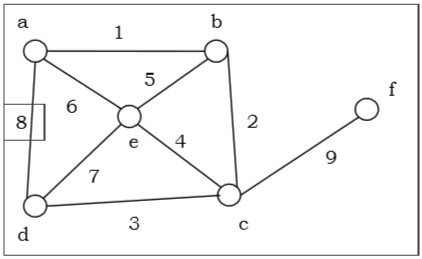
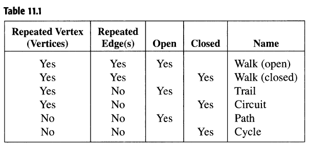

## Graph Theory (Part 1)

### Summary
* A graph is basically a network of points connected to each other
    * A simple example is a graph indicating who are friends with each other
    * Another example is a set of points or locations
* Especially in later senior questions, graphs have been tested by far the most in CCC Senior
* Usually indicated in the form of some network
* There are many types of graphs with descriptors such as
    * Weighted/unweighted
    * Directed/undirected
    * Simple/multi
    * Connected
    * Trees

Lets give this concept a bit of structure.
### Mathematical Definitions (Discrete Math)
A graph has the following
* A set V of vertices
* A set E of edges, ordered pairs of the form V * V (and possibly a cost)
    * A simpler way to interpret this is that every edge is of the form e = {a, b}, where a and b are vertices
Such a graph would be called G(V, E).

Common definitions in a graph:
* A graph is called simple if there exists at most one edge between two vertices
    * The opposite of this is called a multigraph
* A graph is called weighted if there are weights (or costs) on a graph, otherwise it is called unweighted
    * A simple example of weighted graph is a set of locations, where the weight is the distance between two locations
* A graph is called directed if its edges have direction, otherwise it is called undirected
    * Directions make it so that you can go one way but not the other
    * Eg. in a network of friends, Bob may be Alices friend but Alice may not be Bob's friend
    * Eg. in a network of locations there are one way roads
* A graph is called connected if you can reach every vertex
* A graph is called empty if it has not vertices
* A loop is an edge that goes to the same vertex that it starts at
* An edge that is connected to a vertex is called incident to the vertex
* If two vertices have a common incident edge it is called adjacent

Here is a set of definitions of things you should know but should not memorize:

* A walk starts at a vertex, goes to an incident edge, then an incident vertex and so on, ending at another vertex
    * Everything above can be considered a type of walk
* Open walks indicate that it ends at where it starts at 

Next lesson will be the applications of these graphs, such as with BFS and DFS.
