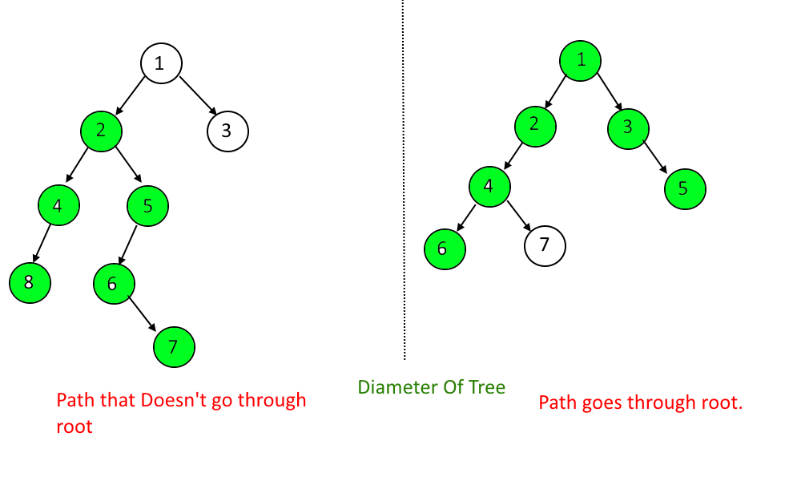

## Graph Theory (Part 1)

### Summary
* The next few weeks
* BFS
* DFS
* Diameter of a Graph
* Demo
    * Possible demonstration of how to initiate a graph

### The Next Few Weeks
The following are things I want to cover in the next few weeks, though some may have to come after the CCC.
* Finish off graph theory with realistic implementations
    * Python code for BFS, DFS and Diameter of a graph
    * Weighted Graph Definitions
        * Shortest Distance
        * Minimum Spanning Tree
* Recursion
    * Fibonnaci numbers
* Dynamic Programming
    * Knapsack problem
* Sorting algorithms
    * Insertion sort
    * Bubble sort
    * Quick sort
    * Merge sort
    * Counting sort
* Data structure: heap

### BFS and DFS


* BFS = Breadth-First Search
    * Diagram on the right (its easier to learn visually)
    * Starts at the root, then goes to nodes with depth 1, then depth 2 and so on
    * Generally use a queue and 
```pseudocode
#Pseudocode
root = 0
queue = empty queue()
queue.push(root)
while queue is not empty
    node = queue.pop()
    print node
    for connected_node connected to node
        if connected_node has not been visited
            queue.push(connected_node)
```
* DFS = Depth-First Search
    * Diagram on the left
    * Starts with the root, then goes on way as deep as possible, then take a step back and go to the next deepest node and so on
    * Usually simply use recurion
```
root = 0
function dfs(node)
    print node
    for connected_node in node
        print node
```

### Diameter of a Tree

* Longest line in a tree
* Generally, you just need to find the node furthest from any node, then apply the same thing again
* You can just BFS twice

### Demo
* I will initiate the graph shown above in Python and show you what BFS and DFS in Python can be like

```python
# Python 3
g = {0: {1, 2}, 1: {0, 3, 4}, 2: {0, 5, 6}, 3: {1}, 4: {1}, 5: {2}, 6:{2}}
# You can also use
g = [{1, 2}, {0, 3, 4}, {0, 5, 6}, {1}, {1}, {2}, {2}]
```