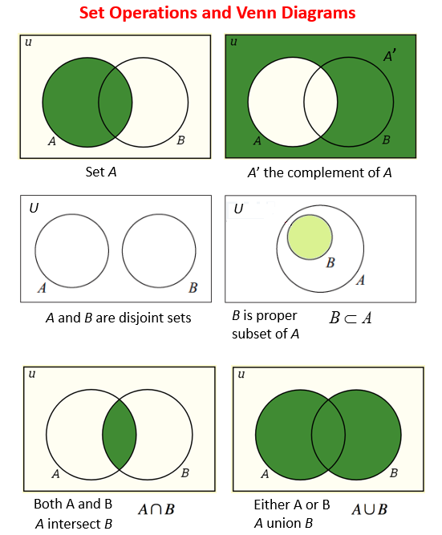

## Lesson on Array Lists, Linked Lists, and Sets
### Arrays
* Basically only Java calls this Array List so we will just call it array here
* Suppose you run at the speed of light and you have a row of cupboards which contain pieces of information
    * This is analogous to an array
* For an array, reading and writing anywhere in the array is constant time, however deletion is O(k) time, where k is the number of elements from the end
    * This is because everything else from the end has to be moved one spot down
* Features:
    * Accessing a random index (O(1) time)
    * Insertion and deletion anywhere (O(k) time)
* In Python, you can implement this with a regular list

### Linked Lists
* Firstly, this is really inefficient and impractical and usually not used
    * Furthermore, you have to implement it manually
* Think about a train, you can insert or delete a boxcar anywhere but traversing through it may be more difficult
* So almost opposite of array: accessing random index is linear time but insertion and deletion is constant time
* In theory, how it works is that you have a series of nodes that have a value and a pointer to the next node
    * If you want the kth node, you have to go node to node using the pointers
    * If you want to insert a value however, you can simply redirect another node to the new node and direct the new node's pointer to the next node
* Doubly linked list works both ways: every node points both forward and backwards making it take up more memory but traversing backwards is faster
* Features:
    * Accessing a random index (O(k) time)
    * Insertion and deletion anywhere (O(1) time)

```python
class Node(object):
    def __init__(self):
        self.data = None # contains the data
        self.next = None # contains the reference to the next node

class LinkedList:
    def __init__(self):
        self.cur_node = None

    def add_node(self, data):
        new_node = Node() # create a new node
        new_node.data = data
        new_node.next = self.cur_node # link the new node to the 'previous' node.
        self.cur_node = new_node #  set the current node to the new one.

    def list_print(self):
        node = self.cur_node # cant point to ll!
        while node:
            print node.data
            node = node.next

# source: https://stackoverflow.com/questions/280243/python-linked-list 
```

### Sets
* According to the mathematical definition, a set is a container of elements (which can be any object such as strings, tuples, integers, dictionaries or other sets) such that no element is repeated
* An outline of set operations can be found here. These include: (Frankly you don't need most of these)
    * Union and intersection
    * Insertion and deletion
    * Checking for membership
    * Subsets and supersets

* However, conventionally, usually sets include integers, tuples or strings
    * In Python, only immutable objects are allowed: so you can not easily put dictionaries, sets, lists (you must use a tuple) or other objects in sets
    * In Java, this is called a HashSet
* If we want to keep count of the number of elements is repeated we can use a multiset or whats called a bag
    * In Python this is called a Counter from the collections library
    * This can be extremely time saving in a competitions when you want to count the number of occurances of certain letters in a string for example
* Usually used for visited sets when you use recursion and want to avoid repeats (infinite recurisons)
    * Extremely useful in BFS and DFS
* Features: (bare minimum)
    * Insertion and deletion
    * Checking for membership in a set
    * Union and intersection of sets (optional)

```python
empty_set = set() # this gives you and empty set
empty_dictionary = {} # this would give you an empty dictionary
defined_set = {'a', 'b', 'c', 1, 2, 3} # however in this case we can use set brackets or curly brackets

# search up documentation for the rest of the operations of sets in Python
```
